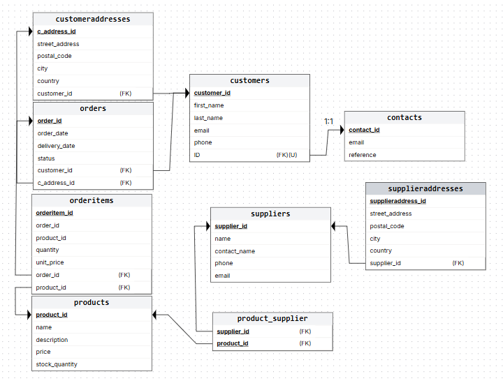

# REST API – Tietokantaratkaisut

## Sisällysluettelo
- [Resurssit](#resurssit)
- [HTTP-metodit](#http-metodit)
- [API Endpointit](#api-endpointit)
- [Response / Request](#response-request)
- [Status Codes](#status-codes)
- [Tietokanta toteutus](#tietokanta-toteutus)
- [Database](#database)
- [Arkkitehtuuri](#arkkitehtuuri)

Projekti on Tietokantaratkaisut-kurssilla toteutettu REST API -pohjainen taustapalvelu pienelle tilausjärjestelmälle/verkkokaupalle.
API mahdollistaa asiakkaiden, tilausten, tuotteiden ja toimittajien hallinnan.

Sovellus on toteutettu käyttäen:

- Spring Boot
- Spring Web
- Spring Data JPA

Projektissa on hyödynnetty useita tietokantakurssilla opittuja ominaisuuksia:

- CRUD REST API -rajapinnat
- tietokantaindeksit
- näkymät (Views)
- transaktiot
- liipaisimet (Triggers)
- tapahtumat (Events)
- proseduurit
- temporaalitaulut
- tietokantakäyttäjät ja oikeudet

# Resurssit

- **Customers** – Käyttäjät  
- **Contacts** – Käyttäjien kontaktit  
- **CustomerAddress** – Käyttäjien osoitteet  
- **Orders** – Käyttäjien tilaukset  
- **OrderItems** – Tilauksen tuotteet  
- **Products** – Tuotteet  
- **Suppliers** – Tavaran toimittajat  

# HTTP-metodit

| Metodi | Kuvaus |
|--------|--------|
| **GET** | Hakee resurssin tai resurssit |
| **PUT** | Päivittää olemassa olevan resurssin tiedot |
| **POST** | Luo uuden resurssin |
| **DELETE** | Poistaa resurssin |

---
# API Endpointit
| Metodi | Endpoint                                      | Kuvaus                                    |
| ------ | --------------------------------------------- | ----------------------------------------- |
| GET    | `/customers`                                  | Hakee kaikki asiakkaat                    |
| GET    | `/customers/{id}`                             | Hakee asiakkaan ID:n perusteella          |
| POST   | `/customers`                                  | Luo uuden asiakkaan                       |
| PUT    | `/customers/{id}`                             | Päivittää asiakkaan tiedot                |
| DELETE | `/customers/{id}`                             | Poistaa asiakkaan                         |
| GET    | `/contacts`                                   | Hakee kaikki kontaktit                    |
| GET    | `/contacts/{id}`                              | Hakee kontaktin ID:n perusteella          |
| POST   | `/contacts`                                   | Luo uuden kontaktin                       |
| PUT    | `/contacts/{id}`                              | Päivittää kontaktin                       |
| DELETE | `/contacts/{id}`                              | Poistaa kontaktin                         |
| GET    | `/customeraddress`                            | Hakee kaikki osoitteet                    |
| GET    | `/customeraddress/{id}`                       | Hakee osoitteen ID:n perusteella          |
| POST   | `/customeraddress`                            | Luo uuden osoitteen                       |
| PUT    | `/customeraddress/{id}`                       | Päivittää osoitteen                       |
| GET    | `/orders`                                     | Hakee kaikki tilaukset                    |
| GET    | `/orders/{id}`                                | Hakee tilauksen ID:n perusteella          |
| POST   | `/orders`                                     | Luo uuden tilauksen                       |
| PUT    | `/orders/{id}`                                | Päivittää tilauksen                       |
| GET    | `/orderitems`                                 | Hakee kaikki tilausrivit                  |
| GET    | `/orderitems/{id}`                            | Hakee tilausrivin                         |
| POST   | `/orderitems`                                 | Luo uuden tilausrivin                     |
| PUT    | `/orderitems/{id}`                            | Päivittää tilausrivin                     |
| DELETE | `/orderitems/{id}`                            | Poistaa tilausrivin                       |
| GET    | `/products`                                   | Hakee kaikki tuotteet                     |
| GET    | `/products/{id}`                              | Hakee tuotteen ID:n perusteella           |
| POST   | `/products`                                   | Luo uuden tuotteen                        |
| PUT    | `/products/{id}`                              | Päivittää tuotteen                        |
| DELETE | `/products/{id}`                              | Poistaa tuotteen                          |
| GET    | `/suppliers`                                  | Hakee kaikki toimittajat                  |
| GET    | `/suppliers/{id}`                             | Hakee toimittajan                         |
| POST   | `/suppliers`                                  | Luo uuden toimittajan                     |
| PUT    | `/suppliers/{id}`                             | Päivittää toimittajan                     |
| GET    | `/views/search?first_name={first_name}`       | Hakee näkymästä asiakkaan uudet tilaukset |
| GET    | `/orders/total/{customer_email}`              | Hakee asiakkaan tilausten kokonaissumman  |
| PATCH  | `/products/increase-prices?percent={percent}` | Korottaa kaikkien tuotteiden hintoja      |

# Response/Request


## Customers

### GET /customers
### GET /customers/{id}
Hakee asiakkaat.

##### Response
```json
{
  "id": 1,
  "email": "vsmith1@example.com",
  "phone": "001-789-824-7188x591",
  "firstname": "Mikko",
  "lastname": "Carey"
}
```
### PUT /customers/{id}
päivittää asiakkaan tiedot.

#### Request
```json
{
  "id": 1,
  "email": "vas@example.com",
  "phone": "001-789-824-7188x591",
  "firstname": "Mikko",
  "lastname": "Carey"
}
```

### POST /customers

#### Request
```json
{
  "email": "vas@example.com",
  "phone": "001-789-824-7188x591",
  "firstname": "Mikko",
  "lastname": "Carey"
}
```

### DELETE /customers/{id}
Poistaa asiakkaan.

## Contacts

### GET /contacts 
### GET /contacts/{id}

Hakee kontakti tiedot.

#### Response
```json
{
  "id": 1,
  "email": "hwilliams5002@example.org",
  "reference": "316e8f76f94b5b1dd8372d78fe7f67ea",
  "customer": null
}
```
### PUT /contacts/{id}

#### Request
```json
{
  "id": 1,
  "email": "vasd@example.org",
  "reference": "316e8f76f94b5b1dd8372d78fe7f67ea",
  "customer": null
}
```
### POST /contacts

#### Request
```json
{
  "email": "vasd@example.org",
  "reference": "316e8f76f94b5b1dd8372d78fe7f67ea",
  "customer": null
}
```
### DELETE /contacts/{id}

## CustomerAddress

### GET /customeraddress 
### GET /customeraddress/{id}
#### Response
```json
{
  "id": 1,
  "city": "Larryview",
  "country": "Guadeloupe",
  "streetAddress": "39650 Harrington Plains Suite 474",
  "postalcode": "95942"
}
```
### PUT /customeraddress/{id}

#### Request
```json
{
  "id": 1,
  "city": "Larryview",
  "country": "Guadeloupe",
  "streetAddress": "39650 Harrington Plains Suite 474",
  "postalcode": "95942"
}
```
### POST /customeraddress

#### Request
```json
{
  "city": "Larryview",
  "country": "Guadeloupe",
  "streetAddress": "39650 Harrington Plains Suite 474",
  "postalcode": "95942",
  "customer": {
    "id": 51
  }
}
```
## Orders

### GET /orders 
### GET /orders/{id}

#### Response
```json
{
  "id": 1,
  "order_date": "2024-04-03T14:51:08.000+00:00",
  "delivery_date": "2024-04-06T13:16:43.000+00:00",
  "status": "CANCELLED",
  "orderItems": [
      {
          "id": 2,
          "orderId": 1,
          "productId": 551,
          "quantity": 3,
          "unit_price": 611.67
      }
  ]
}
```
### PUT /orders/{id}

#### Request
```json
{
  "customerId": 1,
  "customerAddressId": 2,
  "deliveryDate": "2024-04-06T13:16:43.000+00:00",
  "status": "CANCELLED",
  "orderItems": [
    {
      "productId": 5,
      "quantity": 2,
      "unit_price": 25.00
    },
    {
      "productId": 2,
      "quantity": 1,
      "unit_price": 736.44
    }
  ]
}
```
### POST /orders

#### Request
```json
{
  "customerId": 1,
  "customerAddressId": 2,
  "order_date": "2024-04-03T14:51:08.000+00:00",
  "delivery_date": "2024-04-06T13:16:43.000+00:00",
  "status": "NEW",
  "orderItems": [
    {
      "productId": 1,
      "quantity": 2,
      "unit_price": 611.67
    },
    {
      "productId": 5,
      "quantity": 1,
      "unit_price": 736.44
    }
  ]
}
```
## OrderItems

### GET /orderitems 
### GET /orderitems/{id}

#### Response
```json
{
  "id": 1,
  "orderId": 1,
  "productId": 426,
  "quantity": 2,
  "unitPrice": 736.44
}
```
### PUT /orderitems/{id}

#### Request
```json
{
  "orderId": 143,
  "productId": 5,
  "quantity": 3,
  "unitPrice": 19.99
}
```
### POST /orderitems

#### Request
```json
{
  "orderId": 14443,
  "productId": 5,
  "quantity": 3,
  "unitPrice": 19.99
}
```
### DELETE /orderitems/{id}

## Products

### GET /products 
### GET /products/{id}


#### Response
```json
  {
    "id": 1,
    "name": "Product 1",
    "description": "Her fall move current him.",
    "price": 49.51,
    "stock_quantity": 1620
  }
```

### PUT /products/{id}

#### Request
```json
{
  "id": 1000,
  "name": "Product 14",
  "description": "Her fall move current him.",
  "price": 49.51,
  "stock_quantity": 1620
}
```
### POST /products

#### Request
```json
{
  "name": "Product 1",
  "description": "Her fall move current him.",
  "price": 49.51,
  "stock_quantity": 1620
}
```
### DELETE /products/{id}

## Suppliers

### GET /suppliers 
### GET /suppliers/{id}

#### Response
```json
{
  "name": "Polar Electronics Oy",
  "contact_name": "Mia Manninen",
  "phone": "0401001000",
  "email": "mia.manninen@polarelec.fi",
  "address": [
      {
          "street_address": "Kairatie 5",
          "postal_code": "96400",
          "city": "Rovaniemi",
          "country": "Suomi"
      }
  ]
}
```
### PUT /suppliers/{id}

#### Request
```json
{
  "name": "Polar Electronics Oy",
  "contact_name": "Mia Manninen",
  "phone": "0401001000",
  "email": "mia.manninen@polarelec.fi",
  "address": [
      {
          "street_address": "Kairatie 5",
          "postal_code": "96400",
          "city": "Rovaniemi",
          "country": "Suomi"
      }
  ]  
}
```
### POST /suppliers

#### request
```json
{
  "name": "Polar Electronics Oy",
  "contact_name": "Mia Manninen",
  "phone": "0401001000",
  "email": "mia.manninen@polarelec.fi",
  "address": [
      {
          "street_address": "Kairatie 5",
          "postal_code": "96400",
          "city": "Rovaniemi",
          "country": "Suomi"
      }
  ]  
}
```

## Views
Pääsy tietokantaan luotuihin näkymiin.

Hakee näkymästä uudet tilaukset etunimen perusteella.

Näkymä yhdistää useita tauluja (Customers, Orders, OrderItems ja Products)
ja palauttaa asiakkaan uudet tilaukset sekä niihin liittyvät tuotteet.

### GET /views/search?first_name={first_name}

#### Response
```json
{
  "id": 181269,
  "first_name": "Mikko",
  "last_name": "Carey",
  "email": "vas@example.com",
  "name": "Turbo Blade 398",
  "status": "NEW",
  "quantity": 2,
  "unit_price": 534.50,
  "total": 1069.00
}
```

## Massaoperaatiot
Operaatiot, jotka käsittelevät useita tietueita kerralla.

### GET /orders/total/{customer_email}

#### Response
```json
{
  "orderId": 58662,
  "total": 13208.2
}
```

### PATCH /products/increase-prices?percent={percent}
Korottaa kaikkien tuotteiden hintaa annetulla prosentilla.

#### Response
```json
Updated prices for 1001 products.
```

## Status Codes

| Koodi | Selitys |
|------|---------|
| 200 | OK – Pyyntö onnistui |
| 201 | Created – Resurssi luotiin |
| 204 | No Content – Resurssi poistettu |
| 400 | Bad Request – Virheelliset tiedot |
| 404 | Not Found – Resurssia ei löytynyt |
| 500 | Internal Server Error – Palvelinvirhe |


---
# Tietokanta toteutus

## Indeksit
Indeksejä käytetään kyselyiden nopeuttamiseen.
### Customers
- **idx_email**
- **idx_firstname**
### Products
- **idx_stock_quantity**

## Kyselyiden Optimointi
Kyselyitä, joissa haetaan tietoja muuttujien perusteella on optimoitu käyttämällä indeksejä. Suorituskykyä on testattu käyttämällä **mysqlslap**-työkalua. Esimerkiksi asiakkaan nimen perusteella tehtävä haku hyödyntää indeksiä, jolloin kysely suoritetaan nopeammin.

## Transaktiot
Seuraavat operaatiot on toteutettu tietokantatransaktioina, jotta tietokannan eheys säilyy virhetilanteissa.

- **GetSum**
- **IncreaseAllPrices**
- **AddOrder ja UpdateOrder**
- **AddOrderItem ja UpdateOrderItem**

Transaktiot varmistavat, että kaikki operaatiot suoritetaan kokonaisuutena tai ne perutaan virheen sattuessa.

## Lukot
Tietokanta käyttää oletuseristystasoa sekä automaattisia lukkoja.

## Näkymät
Tietokantaan toteutettu näkymä **NewOrders** , jonka avulla löydetään asiakkaan uudet tilaukset. Näkymä hakee käyttäjän tiedot ja tilausten tiedot joiden status on "NEW".

Näkymää voidaan käyttää API:n endpointin kautta:
```/views```

## Aktiivisuus
### Liipasin
Tietokantaan lisätty liipaisin, joka tallentaa uusien tilausten yhteydessä:
- Käyttäjän id:n
- Aikaleiman
Tietokantaan tehtyyn tilausloki tauluun
### Tapahtuma
Tietokantaan lisätty tapahtuma, joka tallentaa tilausten määrän 12 tunnin välein uudetTilaukset nimiseen tauluun.
### Proseduurit
Tietokantaan lisätty proseduuri UserOrders(), joka hakee käyttäjän id:llä tilaukset.

**Liipaisinta, tapahtumaa ja proseduuria ei ole toteutettu API-tasolla, vaan ne toimivat vain tietokannassa**

## Tietosuoja
### Käyttäjät
- dp_user:
  - Kaikki oikeudet projektin tietokantaan
- p_user:
  - SELECT, INSERT, UPDATE: customers, orders, orderitems
  - SELECT: products, productcategories
 
### Varmuuskopiointi
Tietokannasta voidaan ottaa varmuuskopioita manuaalisesti määritetyllä komennolla.

## Temporaaliominaisuudet
Products taulu on määritelty: **WITH SYSTEM VERSIONING** lauseella, joka mahdollistaa tuotteiden muutosten historian tallentamisen tauluun.

**Pelkästään tietokantatasolla**

## Tietokantasuhteet
### tietokanta hyödyntää seuraavia relaatiosuhteita:
- 1:1 (OneToOne)
- 1:M (OneToMany)
- M:M (ManyToMany)

## Latausstrategia
### Tietokanta hyödyntää:
- Lazy loading
- Eager loading
<br>
Näitä käytetään tilanteen mukaan suorituskyvyn optimoimiseksi.

## Massaoperaatiot
Tietokanta hyödyntää massaoperaatioita, joiden avulla voidaan käsitellä useita tietueita kerralla.

### GetOrderTotalByCustomerEmail
Hakee asiakkaan tilausten kokonaissumman sähköpostiosoitteen perusteella.
### IncreaseAllPrices
Korottaa kaikkien tuotteiden hintoja.

### Muuntimet ja tapahtumat

#### OrderStatus
Enum luokka, joka muuntaa tietokannan merkkijonot Java-enumeiksi, joka helpottaa statuksen käsittelyä sovelluksessa.
#### Tapahtuma
Order_date toteutettu @PrePersist annotaatiolla, joka tallentaa tilausajan automaattisesti.


---

# Database



## Suhteet

- **Customers**
  - OneToOne **Contact**
  - OneToMany **Orders**
  - OneToMany **CustomerAddress**
- **Contacts**
  - OneToOne **Customers**
- **CustomerAddress**
  - ManyToOne **Customers**
- **Orders**
  - ManyToOne **Customers**
  - ManyToOne **CustomerAddress**
- **OrderItems**
  - ManyToOne **Orders**
  - ManyToOne **Products**
- **Products** – **Tuotteet**
  - ManyToMany **suppliers**
- **Suppliers**
  - ManyToMany **products**
  - OneToMany **SupplierAddress**

# Arkkitehtuuri

Sovellus noudattaa Spring Boot -sovelluksille tyypillistä kerrosarkkitehtuuria:
- entity
- controller
- service
- repository
- dto
- converter

# Projektin käynnistys

1. kloonaa projekti

git clone

2. siirry projektikansioon

cd projekti

3. käynnistä sovellus

Sovellus käynnistyy osoitteeseen:

http://localhost:8080
